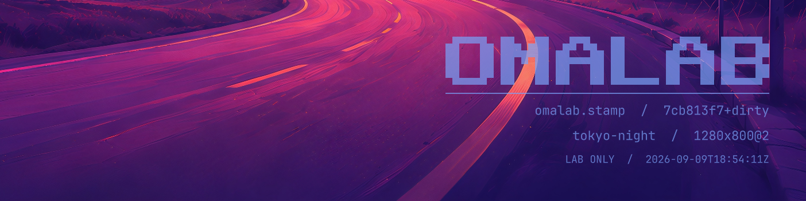

**Develop shell plugins against a real Omarchy desktop without restarting your own.**

`omalab` runs the installed Hyprland compositor and Omarchy shell around your
plugin checkout, with disposable configuration, state and session services.
It starts offscreen. Bring it into view deliberately, capture native-resolution
screenshots, send plugin IPC, and remove the lab when you are finished.

This is a development environment, **not a sandbox for untrusted code**.

[Quick start](#quick-start) · [Commands](#commands) · [Isolation](#isolation-boundaries)
· [CI](docs/CI.md) · [Engineering reference](docs/HOW.md) · [Agent skill](skills/omalab/SKILL.md)

## Requirements

- Linux with an installed **Omarchy desktop and a running Hyprland Wayland session**.
- The session's normal user, environment and access to its compositor sockets.
- Hyprland, Quickshell, PipeWire, D-Bus, grim, jq, Git and the standard shell
  utilities supplied by Omarchy. No additional runtime package or root access
  is needed on the verified installation.

Verified with Omarchy **4.0.2**, Hyprland **0.56.2**, Quickshell **0.3.1** and
PipeWire **1.6.8**. The CLI depends on Omarchy's shell/plugin API and Hyprland's
Lua API; other versions are not yet a compatibility guarantee.

> **Offscreen is not desktop-free.** A lab needs an existing host compositor.
> A stock GitHub-hosted Linux runner, a plain container, or a machine with only
> an SSH session cannot run the graphical workflow as-is.

## Install

```sh
git clone https://github.com/njpatel/omalab.git "$HOME/.local/share/omalab"
mkdir -p "$HOME/.local/bin"
ln -s "$HOME/.local/share/omalab/bin/omalab" "$HOME/.local/bin/omalab"
omalab --help
```

Ensure `~/.local/bin` is on `PATH`. Keep the checkout intact: the executable
locates the bundled stamp plugin relative to itself. There is no build step.

To update, pull the checkout with `git pull --ff-only`. Recreate existing labs
after an update; `restart` reloads the lab shell, not its compositor or generated
environment.

## Quick start

Run these commands from a terminal inside your Omarchy session. The plugin
directory must contain a valid Omarchy `manifest.json`.

```sh
cd ~/src/my-plugin
omalab up . -n dev
omalab ipc -n dev shell listPlugins
mkdir -p artifacts
omalab shot -n dev artifacts/preview.png
```

The checkout is **symlinked, not copied**. The lab starts with the stock bar,
Tokyo Night theme and wallpaper, your plugin, and a provenance stamp. Bar
widgets go into their manifest's `barWidget.defaultSection`; service plugins
are enabled without needing a bar slot.

Only show it when you want a visible window:

```sh
omalab show -n dev
omalab hide -n dev
```

After editing your checkout:

```sh
omalab restart -n dev
omalab shot -n dev artifacts/updated.png
omalab log -n dev
```

Finish by removing only that lab:

```sh
omalab down -n dev
```

`down` deletes the lab's private state. Save screenshots, logs and any useful
fixtures first. If `up` fails, its diagnostic files remain until `down`.

## Settings, fixtures and services

The lab deliberately starts without your desktop's plugin configuration,
credential files, application history or cached data. A plugin displaying
"not configured", "sign in" or "no data" can be behaving correctly. That does
not make a QML TypeError or binding loop an expected condition: read the log.

Use `exec` to configure or inspect the **lab's** environment:

```sh
omalab exec -n dev printenv HOME XDG_CONFIG_HOME XDG_STATE_HOME
omalab exec -n dev sh -c 'cat "$HOME/.config/omarchy/shell.json"'
omalab exec -n dev bash
```

The last command opens a shell in your current terminal, with the lab's
HOME, display, session bus and audio connection. Use it for plugin setup,
test fixtures or plugin-specific commands. It is not a container: the working
directory and the rest of the filesystem remain accessible.

Quote variables when expansion must happen inside the lab. In the example
above, single quotes prevent your outer shell from expanding its own `$HOME`.
Do not automatically copy production credentials into a disposable lab.

Additional plugins must already be installed on the machine:

```sh
omalab up . -n integration --plus omarchy.notifications
```

The built-in notification service is **off by default**, leaving its private
bus name available to notification-service plugins. Enable the stock service
only when it is the one you want. Other service dependencies, test data and
backend processes belong to your plugin's setup; omalab does not invent or
start them for you.

## Screenshots

```sh
omalab shot -n dev artifacts/preview.png
omalab shot -n dev artifacts/large.png --size 1600x1000
omalab shot -n dev artifacts/retina.png --size 1280x800 --scale 2
```

Sizes are **logical pixels**. `1280x800` at scale `2` produces a `2560x1600`
PNG. Capture reads the child compositor directly, so parent notifications and
other host overlays do not enter the image. Hide a visible lab before shooting.

- Without a file argument, the filename is `omalab-<name>-<WxH>@<scale>.png`
  in the current directory. An explicit destination's parent directory must exist.
- Size-only overrides keep the shell running.
- **Scale overrides restart the lab shell twice**: once to render at the target
  scale, and again when restoring it. Open panels and in-memory plugin state reset.
- Original geometry is restored after capture or a catchable failure. The final
  file is published atomically after successful restoration.

For a stateful screenshot, start at the target scale first, then drive your
plugin and capture without changing scale:

```sh
omalab up . -n preview-2x --size 1280x800 --scale 2
# Open the desired state through your plugin's documented IPC or UI.
omalab shot -n preview-2x artifacts/stateful.png
omalab down -n preview-2x
```

The stamp records plugin id, commit/dirty state, theme, geometry and UTC date.
Commit/date refresh on shell startup; screenshot overrides update its geometry.
Use `--no-stamp` on `up` for unstamped product images. This does not freeze the
bar clock, weather, network data or your plugin's live content.

## Commands

```text
omalab up <plugin-dir> [-n NAME] [--theme NAME|mine] [--size WxH] [--scale N]
                       [--plus PLUGIN-ID ...] [--shared-bus] [--no-stamp]
omalab show [-n NAME]
omalab hide [-n NAME]
omalab shot [-n NAME] [FILE] [--scale N] [--size WxH]
omalab ipc [-n NAME] <target> <method> [args...]
omalab exec [-n NAME] <cmd...>
omalab log [-n NAME] [-f]
omalab restart [-n NAME]
omalab ls
omalab down [-n NAME | --all]
```

Defaults: name `default`, theme `tokyo-night`, size `1280x800`, scale `1`.
`--theme mine` uses the host's current theme and wallpaper, not its plugin
configuration. Names are 1–48 letters, digits, underscores or hyphens, starting
with a letter or digit. Dimensions are 200–8192 logical pixels; scale must be
positive and at most 4, with integral physical dimensions no larger than 16384.

Labs can run side by side. Use a unique name per task or job. Mutating CLI
operations are serialized per runtime root. `down --all` really removes every
lab belonging to that user—do not use it as a shared-runner cleanup shortcut.

## Isolation boundaries

| Resource | Lab behavior |
|---|---|
| HOME, configuration, cache, application state | New writable directories under `$XDG_RUNTIME_DIR/omalab/<name>/`. Removed by `down`. |
| Plugin code | Symlink to the real checkout. Edits and writes to that checkout are real. |
| Compositor and Wayland clients | Separate nested compositor, parked on a lab-owned host headless output. |
| Session D-Bus | Private by default. `--shared-bus` deliberately connects to host session services and re-enables Qt portal integration. |
| Audio | Private PipeWire server with no hardware discovery or session manager, even with `--shared-bus`. Empty device lists are intentional. |
| Machine-control services | Idle/lock, battery power profiles, polkit and night light are disabled. |
| Theme | Stock theme staged in the lab; `--theme mine` links to the host's theme/background, which omalab only reads. |
| Filesystem, network, system bus, `/proc` | **Not isolated.** Plugins and `exec` run as your user. |
| Parent environment and agent sockets | **Not scrubbed of arbitrary secrets.** Inherited tokens or an SSH-agent socket may remain reachable. |

A scratch HOME does not prevent a plugin from reading other files, using the
network, or changing the real machine through an explicit command. `down`
cleans up owned lab processes/state; it cannot undo arbitrary external side
effects. **Never use a personal desktop runner for untrusted pull requests.**

## Local automation, SSH and CI

| Where you run it | What is required |
|---|---|
| Terminal in Omarchy | Use the normal desktop user and inherited session environment. |
| Local script or agent | Same session context; unique lab name, capture/log collection, scoped cleanup. No visible window is needed. |
| SSH or a user service | Explicit access to the correct running desktop session and its current environment. Do not guess display numbers or use the newest compositor directory. |
| Dedicated self-hosted CI runner | An active Omarchy session under the runner user, inherited graphical environment, and trusted jobs only. |
| Stock hosted runner or standalone container | Not supported by the current backend. There is no bundled desktop bootstrap, Docker image, X11 backend or `omalab test` command. |

See **[CI and automation](docs/CI.md)** for runner setup, environment handling,
security restrictions, artifact collection and an opt-in GitHub Actions example.
The runnable [smoke helper](examples/ci-smoke.sh) exercises startup, plugin
registration and rendering; it does not replace your plugin's unit tests,
behavioral assertions or visual review.

Run the same smoke check locally from your plugin checkout:

```sh
artifacts=$(mktemp -d)
"$HOME/.local/share/omalab/examples/ci-smoke.sh" "$PWD" "$artifacts"
```

Screenshots are not deterministic goldens out of the box. Pin the desktop,
shell, plugin versions, fonts and theme; control time-dependent data and fixture
state in your own tests. A hard-killed job or compositor failure can interrupt
cleanup. Disposable runner machines are preferable to accumulating state on a
shared desktop.

## Agent skill

Humans only need the CLI. The optional [omalab skill](skills/omalab/SKILL.md)
gives coding agents the safe development loop: unique labs, no unapproved
`show`, explicit credential/shared-bus decisions, real screenshot inspection,
and cleanup of only the lab they created.

Point your agent at that file or install it through your agent's skill loader.
Omalab does not require an agent, change agent configuration, or install a skill
as part of its normal installation.

## Troubleshooting and implementation

- Use `omalab log -n NAME` for the unfiltered shell log; `-f` follows it.
- Failed startup keeps `compositor.log`, `shell.log`, `pipewire.log`, `bus.log`
  and `theme.log` when those stages were reached. Collect them before `down`.
- The short runtime aliases are necessary for Linux's Unix-socket path limit;
  an unusually long `XDG_RUNTIME_DIR` can be rejected before startup.
- Only `show` brings a lab onto a visible workspace. It does not explicitly
  change focus or switch workspaces. No host physical-monitor config is rewritten.
- Teardown removes the virtual output but can leave an inert disabled monitor
  rule in the host's runtime configuration; it deliberately does not reload
  your desktop to erase it.

The [engineering reference](docs/HOW.md) describes the pre-map safety gate,
process ownership, rendering and teardown contracts, and the measured
validation coverage.

## License

Code: [Apache-2.0](LICENSE). Header background: Omarchy's Tokyo Night wallpaper, captured with the omalab stamp at native 2× scale.
